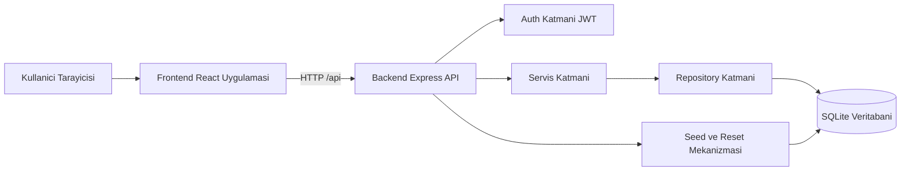

# Bookstore App (Yerel Fullstack Demo)

Bu proje, 3 farklı role sahip bir kitap satış uygulamasıdır:
- Customer
- Manager
- Admin

Uygulama sadece yerelde çalıştırılıp gösterim yapmak için tasarlanmıştır (deploy zorunluluğu yoktur).

## Teknoloji Yığını

- Frontend: React + Vite
- Backend: Node.js + Express
- Veritabanı: SQLite (better-sqlite3)
- Grafikler: Recharts
- Kimlik Doğrulama: JWT (rol tabanlı)

## Proje Yapısı

- `frontend/`: React arayüzü
- `backend/`: Express API + SQLite veritabanı + seed/reset mantığı

## Demo Kullanıcı Bilgileri

- Customer
  - username: `client`
  - password: `client123`
- Manager
  - username: `manager`
  - password: `manager123`
- Admin
  - username: `admin`
  - password: `admin123`

## Özellikler

### Customer
- Kitapları görüntüleme
- Kitap arama
- Filtreleme (yazar, fiyat, stok)
- Sepete ekleme
- Satın alma (ödeme entegrasyonu yok, yalnızca başarı mesajı)
- Stokta olmayan kitapların görseli gri olur ve sepete eklenemez

### Manager
- Customer gibi kitapları görüntüleme/arama/filtreleme
- Backend verisinden grafikler:
  - Aylık gelir
  - Yıllık gelir
  - En çok satan kitaplar

### Admin
- Manager'ın tüm yetkileri
- Kitap ekleme, düzenleme, silme
- Yazar ve fiyat dahil kitap alanlarını düzenleme
- `Admin reset` butonu:
  - Veritabanı içeriğini temizler
  - Gerçekçi dummy verilerle yeniden doldurur

## Kitap Veri Kuralları

- Farklı kitap sayısı üst limiti: 25
- Her kitap şunları içerir:
  - isim (title)
  - yazar
  - fiyat
  - görsel
  - stok
  - kısa ve komik açıklama
- Stok değeri 1'den büyük olabilir

## Seed Verisi

Backend ilk açılışta (veya admin reset sonrası) otomatik olarak şunları seed eder:
- Demo kullanıcılar (`client`/`manager`/`admin`)
- Kitap kataloğu (25 limit kuralı backend'de uygulanır)
- Satış geçmişi (grafiklerin hemen anlamlı görünmesi için)

## Yerelde Kurulum

### 1) Bağımlılıkları kur

Backend:

```bash
cd backend
npm install
```

Frontend:

```bash
cd frontend
npm install
```

### 2) Backend'i çalıştır

```bash
cd backend
npm run start
```

Backend adresi:
- `http://localhost:4000`

### 3) Frontend'i çalıştır

İkinci bir terminal aç:

```bash
cd frontend
npm run dev
```

Frontend adresi (varsayılan):
- `http://localhost:5173`

## API Özeti

Base URL: `http://localhost:4000/api`

- `POST /auth/login`
- `GET /books`
- `GET /books/:id`
- `POST /orders/checkout` (customer)
- `GET /analytics/monthly-revenue` (manager/admin)
- `GET /analytics/yearly-revenue` (manager/admin)
- `GET /analytics/top-selling-books` (manager/admin)
- `POST /admin/books` (admin)
- `PUT /admin/books/:id` (admin)
- `DELETE /admin/books/:id` (admin)
- `POST /admin/reset` (admin)

## Mimari Diyagram



## Sorun Giderme

- `EADDRINUSE: address already in use` hatasi:
  - 4000 veya 5173 portu dolu olabilir.
  - Terminalde calisan eski sureci kapatip tekrar deneyin.

- `Network Error` veya frontend'de API'ye baglanamama:
  - Backend'in acik oldugunu kontrol edin (`http://localhost:4000/api/health`).
  - Frontend'in [frontend/src/api/client.js](frontend/src/api/client.js) dosyasinda `baseURL` degerinin dogru oldugunu kontrol edin.

- Giris basarisiz (401) hatasi:
  - Demo kullanici bilgilerini birebir kullanin.
  - `client/client123`, `manager/manager123`, `admin/admin123`.

- Grafikler bos gorunuyor:
  - Admin hesabiyla `Admin reset` butonuna basin.
  - Bu islem satis gecmisi dahil seed veriyi yeniden olusturur.

- Veritabani temiz baslasin istiyorum:
  - Admin panelindeki `Admin reset` butonu ile verileri sifirlayip yeniden seed edebilirsiniz.

## Notlar

- Bu proje gosterim amacli olarak local-first yaklasimla hazirlanmistir.
- Odeme gecidi entegrasyonu bilerek uygulanmamistir.
- Kod, tek sorumluluk ilkesini destekleyecek sekilde katmanli yapida duzenlenmistir (route/service/repository).
